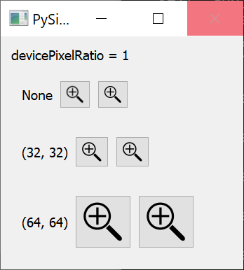
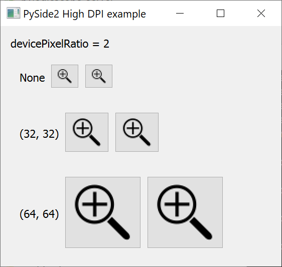

# PySide2 High DPI example

I have been trying and failing to get high-dpi icons to work correctly in 
Qt + PySide2.  The goal is to create and then fix this minimal example.

## Baseline

Win10x64 before without any high DPI setting:

Win10x64 before with high DPI setting:

## References

Here are some QT references:

* https://doc.qt.io/qt-5/highdpi.html
* https://doc.qt.io/qt-5/qpixmap.html#setDevicePixelRatio
* https://doc.qt.io/qt-5/qpainter.html#drawing-high-resolution-versions-of-pixmaps-and-images
* https://doc.qt.io/qt-5/qimagereader.html#high-resolution-versions-of-images
* https://doc.qt.io/qt-5/qicon.html#high-dpi-icons

And some interesting tutorials and forum posts:

* https://vicrucann.github.io/tutorials/osg-qt-high-dpi/
* https://lists.qt-project.org/pipermail/interest/2015-September/019009.html
* https://openapplibrary.org/dev-tutorials/qt-icon-themes

Additional Windows guides:

* https://docs.microsoft.com/en-us/previous-versions/windows/desktop/ms701681(v=vs.85)?redirectedfrom=MSDN
